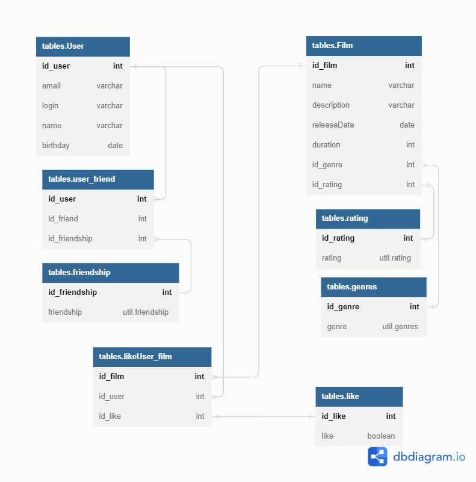

# java-filmorate
## Database scheme

## Query examples
- All users names request

```
SELECT id_user, name
FROM tables.User
```
- All films titles request

```
SELECT id_film, name
FROM tables.Film
```

- 10 most popular films request

```
SELECT sub.fn, count(lk)
FROM (
SELECT 
  f.id_film as id,
  f.name as fn, 
  like.id_like as lk
FROM tables.Film as f
LEFT JOIN tables.likeUser_film as like on f.id_film=like.id_film
ORDER BY like.id_like NULLS LAST ) as sub
GROUP BY sub.id
ORDER BY count(lk)
```
