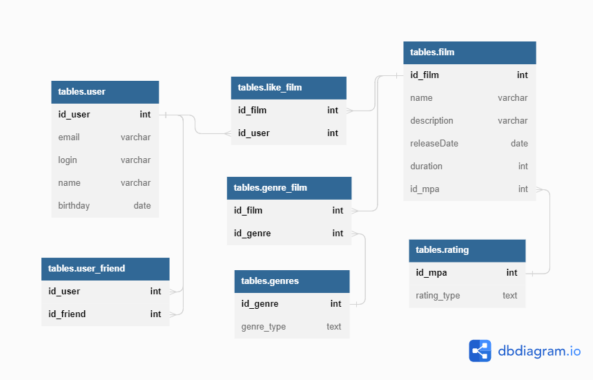

# java-filmorate
## Database scheme

## Query examples
- **All users names request**

```
SELECT id_user, name
FROM tables.user
```
- **All films titles request**

```
SELECT id_film, name
FROM tables.film
```
